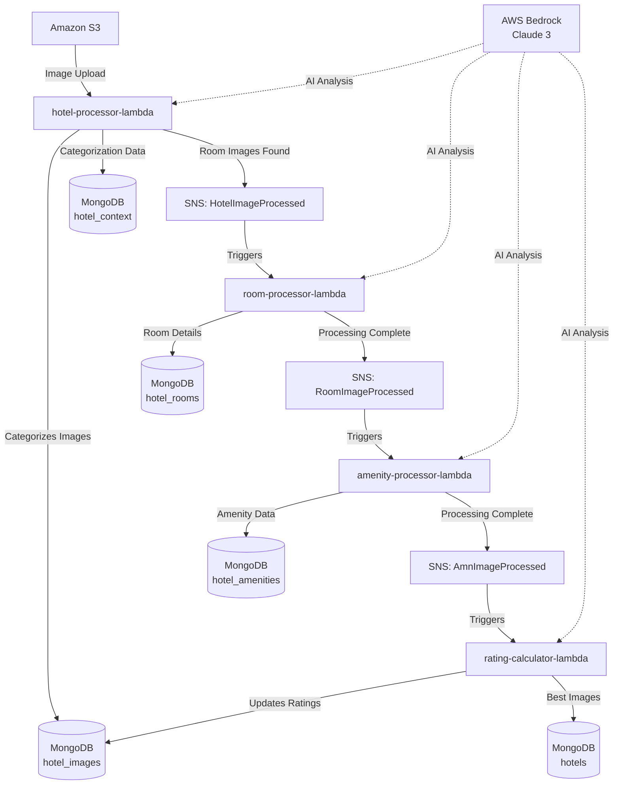

# aws-hackathon

An AWS-based hotel image processing pipeline that uses AI to analyze and categorize hotel images, extract room information, and calculate image quality ratings.

## Components

### AWS Lambda Functions

- **hotel-processor-lambda**: Processes uploaded hotel images and categorizes them into: exterior, interior, foods, leisure, parking, rooms, or bathrooms
- **room-processor-lambda**: Analyzes room images to extract room names and types
- **amenity-processor-lambda**: Identifies and catalogs hotel and room-specific amenities
- **rating-calculator-lambda**: Calculates image quality ratings and selects the best hotel images

### Technologies Used

- AWS Lambda
- AWS Bedrock (Claude 3)
- Amazon S3
- Amazon SNS
- MongoDB

## Data Flow Diagram

## Processing Pipeline

1. Images are uploaded to S3 which triggers the hotel-processor-lambda
2. Hotel images are categorized and stored in MongoDB
3. Room images are processed to extract room details
4. Amenities are identified and associated with hotels/rooms
5. Image quality ratings are calculated

## Data Storage

MongoDB Collections:
- hotel_images: Stores image metadata and URLs
- hotel_rooms: Stores room information
- hotel_amenities: Stores amenity associations
- hotel_context: Stores image categorization data
- hotels: Stores hotel information including main images