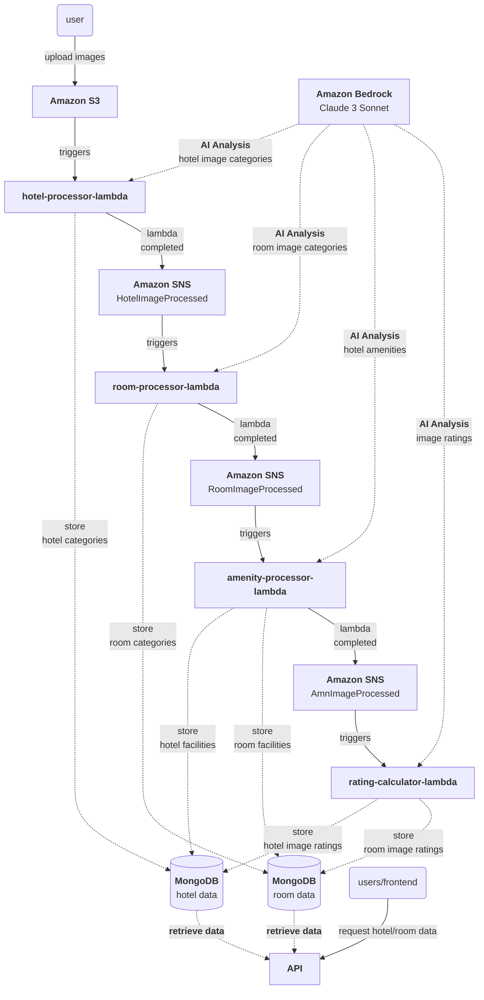

# Hotel Image Classification System

Team Insight Guild ~ [Gen AI Buildathon 2025 @ CodeGen International Pvt Ltd]

https://fb.watch/zrhMduZ318/

https://www.facebook.com/lifeatcodegen.int/posts/pfbid02DayKXaKiUhofFFNjRRbrPe8TLJE1XhEKm7fV5DiJacbP2aYqB7yFNTtaem6DBU4bl

A system that has been based on AWS that uses AI to analyze and categorize hotel related images, extract specific
information.

### Features

- Categorize hotel images into categories like exterior, interior, foods, rooms etc.
- Categorize identified room images into common room types like suite, deluxe, standard etc.
- Extract hotel wise facilities
- Extract room wise facilities
- Calculate ratings for images based on quality, clarity, and relevance and select cover image for the hotel.
- Calculate ratings for images based on quality, clarity, and relevance and select cover image for the room.

### Components

- **Python based web application:** For uploading images & showing results
- **Amazon S3:** For storing images
- **AWS Lambda:** For serverless processing of images
- **AWS Bedrock:** For AI analysis using "Claude 3 Sonnet"
- **Amazon SNS:** For triggering Lambda functions based on events
- **EC2 & MongoDB:** For storing and managing data

## Data Flow Diagram

